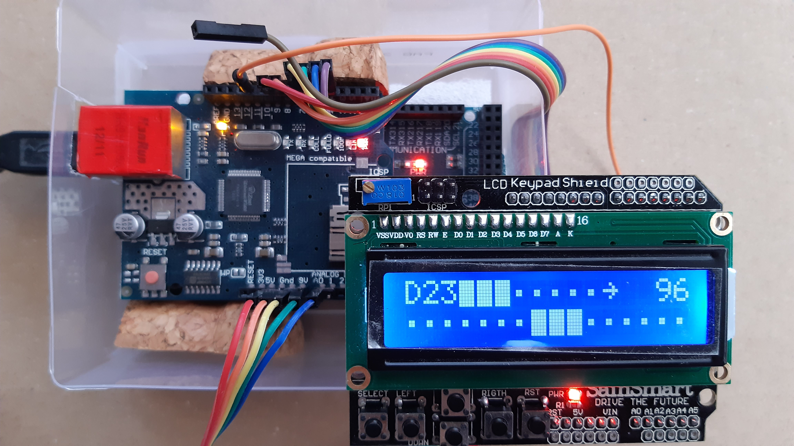

# WrightSlave

A single controller connected by Web, USB, or LCD.

## Setup

Edit `./sketch_WSlave/config.h`

## Commands

Standard REST routes:
- **$**: `/$`
  full status list of all pins if `#define MODE_VERBOSE MODE_VERBOSE_LIST` (or `MODE_VERBOSE_ALL` by default)

- **r**ead: `/r/{pin_id}`
  view a pin

- **w**rite: `/w/{pin_id}/{value}`
  set a value (0-255) to this pin
  (set a pin to OUTPUT mode)
  On digital: false=0-127; true-128-255

- **i**nput: `/i/{pin_id}`
  set a pin to INPUT mode

- **o**utput: `/o/{pin_id}`
  set a pin to OUTPUT mode

Extended routes:
- **h**ide: `/h/{pin_id}`
  hide a pin in the full status list if `#define MODE_VERBOSE MODE_VERBOSE_LIST` (or `MODE_VERBOSE_ALL` by default)

- **s**how: `/s/{pin_id}`
  show a pin in the full status list if `#define MODE_VERBOSE MODE_VERBOSE_LIST` (or `MODE_VERBOSE_ALL` by default)

  NB: use it to customize the webApp.

## webApp

`#define MODE_SERIAL MODE_SERIAL_ETHERNET` (or `MODE_SERIAL_ALL` by default)

The Arduino boots on the DHCP.
If `#define MODE_VERBOSE MODE_VERBOSE_WEBAPP` (or `MODE_VERBOSE_ALL` by default),
open a bowser on `http://{ip}`.

## USB

`#define MODE_SERIAL MODE_SERIAL_USB` (or `MODE_SERIAL_ALL` by default)

If `#define MODE_VERBOSE MODE_VERBOSE_HELP` (or `MODE_VERBOSE_ALL` by default),
write anything and the read the help

## LCD

`#define MODE_SERIAL MODE_SERIAL_LCD` (or `MODE_SERIAL_ALL` by default)

As the wiring is custom, you should read the code ;)
Define your wiring into `./sketch_WSlave/config.h`

## dependancies

### software

- Ethernet.h
- LiquidCrystal.h
- standard Serial (Arduino.h)

### tools

#### custom HTML

- edit ./web/html/index.html
- export to ./sketch_WSlave/_webApp.h by `./web/html2h.h`
- run `./web/docker-compose up` for testing
